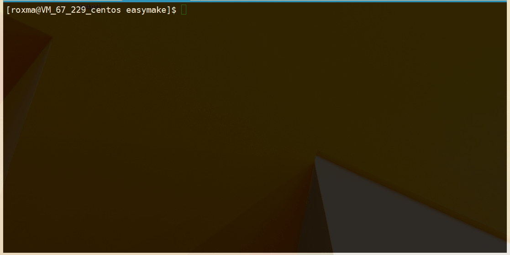

# Getting Started with Easymake #

  
## Introduction ##

Easymake is a generic makefile for C/C++ on linux system. For simple C/C++ applications, you don&rsquo;t even need to write a single line of makefile code to build your target with easymake.

Features description:

* Automatic C/C++ sources (\*.c and \*.cpp) file detection.
* Auto dependency generation and meɪntənəns, to accelerate the build time.
* Simple unit testing supported. Easy management of more than one entry point (the main function) in the project.
* `VPATH` fully supported.
* generate binary files in a separate directory

The following examples will show you how to build you program with easymake step by step. Do not be frightened by such a long article, most of the part in the following section is about writing a simple C/C++ program. easymake is very easy to learn, just as the 'easy' in the name.

## Getting Started ##

